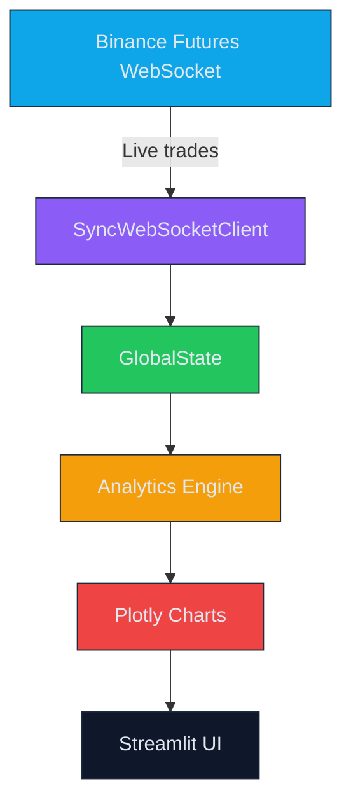
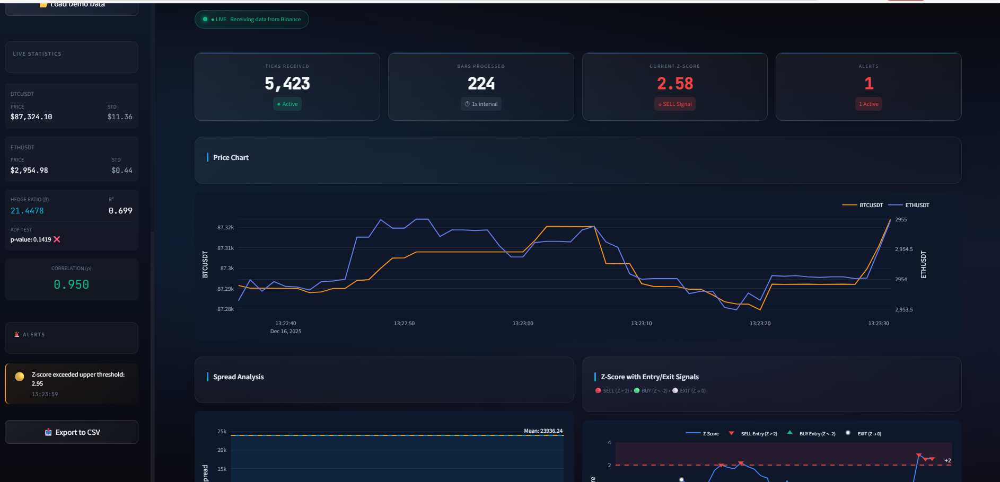
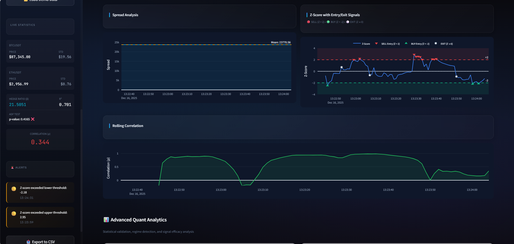
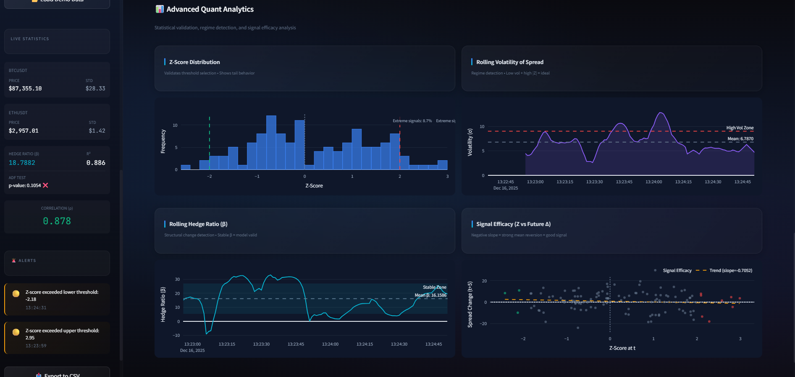

# Gemscap - Real-time Statistical Arbitrage Dashboard

---

## 🎯 Project Overview

**Gemscap** is a premium-grade Streamlit dashboard that streams live Binance Futures trade data, computes a suite of quantitative analytics, and visualises them with glass-morphism styling. The goal is to showcase **statistical validation, regime detection, and signal efficacy** for a statistical-arbitrage strategy - exactly the kind of work a quant developer interview expects.

---

## 🏗️ Architecture Diagram



---

## 📊 Charts & Insights

| Chart | What it Shows | Key Insight |
|-------|--------------|-------------|
| **Z-Score Distribution** | Frequency of Z-scores, highlighting tails beyond ±2 | Validates that the ±2 threshold captures extreme events and quantifies tail risk |
| **Rolling Volatility** | Rolling standard deviation of the spread | Detects regime shifts - low volatility + high Z is ideal; high volatility suggests staying out |
| **Rolling Hedge Ratio** | Time-varying β from rolling regression | Stable β = model valid; drifting β signals structural change |
| **Signal Efficacy** | Scatter of Z-score vs future spread change | Negative slope = strong mean-reversion = good predictive power |
| **Entry/Exit Markers** | Z-score line with BUY/SELL/EXIT markers | Clear visual trading logic - exactly what a trader would act on |

---

## 🖼️ Dashboard Snapshots

| Dashboard Overview | Advanced Analytics | Z-Score Signals |
|:------------------:|:------------------:|:---------------:|
|  |  |  |

---

## 🚀 How to Run

```bash
# Clone the repo
git clone https://github.com/udayhese96/Gemscap-Assignment.git
cd Gemscap-Assignment

# Install dependencies
pip install -r requirements.txt

# Start the dashboard
streamlit run app.py
```

The dashboard will automatically connect to Binance, start ingesting live data, and refresh every second (configurable via `config.py`).

---

## 📁 Project Structure

```
Gemscap/
├─ app.py                # Streamlit UI & chart orchestration
├─ config.py             # Constants, colours, WS params
├─ src/
│   ├─ ingestion/
│   │   ├─ websocket_client.py   # Async Binance WS client + Sync wrapper
│   │   └─ data_normalizer.py    # Normalises raw tick messages
│   ├─ analytics/                # Spread, Z-score, correlation, hedge ratio
│   ├─ processing/               # OHLCV resampling
│   ├─ storage/                  # In-memory data store
│   └─ alerts/                   # Rule engine for threshold alerts
├─ requirements.txt      # Python deps
└─ README.md             # This file
```

---

## 🎉 What the Interviewer Will See

* **Clean, modern UI** - glass-morphism, dark theme, responsive layout
* **Robust real-time pipeline** - async WebSocket with reconnection, thread-safe state
* **Deep quantitative analytics** - five advanced charts each with a clear business insight
* **Professional documentation** - concise overview, architecture diagram, chart table

Feel free to tweak the `REFRESH_RATE_MS` in `config.py` or add more symbols/timeframes to showcase extensibility.

---

*Happy hacking!*
